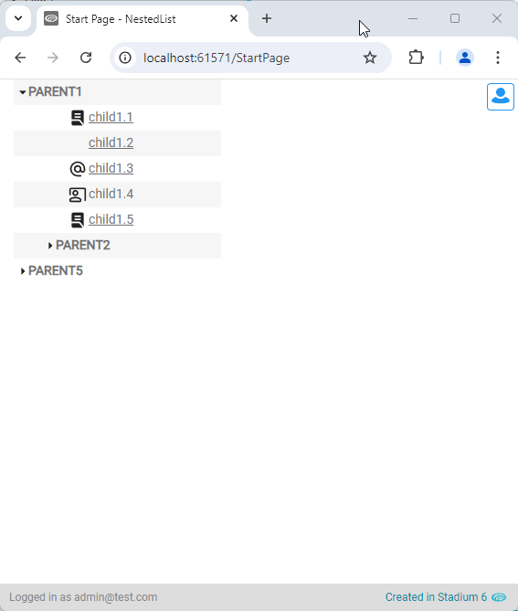

# Nested List <!-- omit in toc -->

A nested list provides a visual representation of parent-child relationships. 



# Version
Initial 1.0

# Setup

## Application Setup
1. Check the *Enable Style Sheet* checkbox in the application properties

## Global Script
1. Create a Global Script called "NestedList"
2. Add the input parameters below to the Global Script
   1. Classname
   2. Collapsed
   3. Data
3. Drag a *JavaScript* action into the script
4. Add the Javascript below into the JavaScript code property
```javascript
/* Stadium Script v1.0 https://github.com/stadium-software/nested-list */
let arrTree = ~.Parameters.Input.Data;
let collaps = ~.Parameters.Input.Collapsed;
let className = ~.Parameters.Input.Classname;
if (!className) { 
    console.error("The classname property is required");
    return false;
}
let container = document.querySelectorAll("." + className);
if (container.length == 0) {
    console.error("No control with the class '" + className + "' was found");
    return false;
} else if (container.length > 1) {
    console.error("The class '" + className + "' is assigned to more than one control");
    return false;
} else { 
    container = container[0];
}
container.classList.add("stadium-nested-list");
for (let i = 0; i < arrTree.length; i++) {
    let parent = createParent(arrTree[i].label, arrTree[i].collapsed);
    container.appendChild(parent);
    displayNested(arrTree[i].children, parent);
}
function displayNested(data, parent) {
    if (data) {
        for (let i = 0; i < data.length; i++) {
            if (data[i].children) {
                let grandParent = parent;
                parent = createParent(data[i].label, data[i].collapsed);
                grandParent.querySelector(".child-wrapper").appendChild(parent);
            } else {
                let node = createChild(data[i].label, data[i].url, data[i].classname);
                parent.querySelector(".child-wrapper").appendChild(node);
            }
            displayNested(data[i].children, parent);
        }
    }
}
function createParent(name, coll) {
    let div = createTag("div", ["parent"]);
    let wrapper = createTag("div", ["wrapper"]);
    let inner = createTag("div", ["child-wrapper"]);
    let input = createTag("input", ["hideme"], [{ name: "type", value: "checkbox" }]);
    if (!collaps && !coll) input.setAttribute("checked", "checked");
    let id = makeId(6);
    input.id = id;
    let label = createTag("label", [], [{ name: "for", value: id }]);
    label.textContent = name;
    div.appendChild(label);
    div.appendChild(input);
    wrapper.appendChild(inner);
    div.appendChild(wrapper);
    return div;
}
function createChild(name, url, className) {
    let div = createTag("div", ["child"]);
    let a = createTag("a", ["nested-list-icon", className], [{name: "target", value:"_blank"}]);
    if (url) a.setAttribute("href", url);
    a.textContent = name;
    div.appendChild(a);
    return div;
}
function createTag(type, arrClasses, arrAttributes) {
    let el = document.createElement(type);
    if (arrClasses && arrClasses.length > 0) {
        arrClasses = arrClasses.filter(function( element ) { return element !== undefined; });
        let cl = el.classList;
        cl.add.apply(cl, arrClasses);
    }
    if (arrAttributes && arrAttributes.length > 0) { 
        for (let i = 0; i < arrAttributes.length; i++) { 
            if (arrAttributes[i].name) el.setAttribute(arrAttributes[i].name, arrAttributes[i].value);
        }
    }
    return el;
}
function makeId(length) {
    let result = "";
    const characters = "ABCDEFGHIJKLMNOPQRSTUVWXYZabcdefghijklmnopqrstuvwxyz0123456789";
    let counter = 0;
    while (counter < length) {
        result += characters.charAt(Math.floor(Math.random() * characters.length));
        counter ++;
    }
    return result;
}
```

## Page
1. Drag a *Container* control to the page
2. Add a unique classname in the control *Classes* property (e.g. nested-list)

## Page.Load
1. Add a *List* action to the event handler (type: Any)
2. Populate the *List* with lists of **parent** and **child** objects that represent hierarchical data (see example below)
3. Drag the "NestedList" script into the event handler and complete the input parameters
   1. Classname: The unique classname you added to the *Container* control (e.g. nested-list)
   2. Collapsed: By default all nodes are shown expanded when the list loads. Add "false" to show them collapsed
   3. Data: The *List* of hierarchical objects

### Hierarchical List Data

**Parent Object Properties**
1. label (required): A string that will be displayed in the node
2. collapsed (boolean): Optionally, add a boolean on a node to show it collapsed

**Child Object Properties**
1. label (required): A string that will be displayed in the node
2. classname (string): Optionally provide a classname to attach to the node
3. url (string): Optionally provide a url to attach to the node

**List Example Data**
```javascript
[
    {
        label: "PARENT1",
        children: [
            { label: "child1.1", classname: "file", url: "https://www.google.com" },
            { label: "child1.2", url: "https://www.google.com" },
            { label: "child1.3", classname: "email", url: "https://www.google.com" },
            { label: "child1.4", classname: "meeting" },
            { label: "child1.5", classname: "file", url: "https://www.google.com" },
            {
                label: "PARENT2",
                collapsed: true,
                children: [
                    { label: "child2.1", classname: "file", url: "https://www.google.com" },
                    { label: "child2.2", classname: "file", url: "https://www.google.com" },
                    { label: "child2.3", classname: "email", url: "https://www.google.com" },
                    { label: "child2.4", classname: "meeting", url: "https://www.google.com" },
                    { label: "child2.5", classname: "file", url: "https://www.google.com" },
                ],
            },
            {
                label: "PARENT3",
                children: [
                    { label: "child3.1", classname: "file", url: "https://www.google.com" },
                    { label: "child3.2", classname: "file", url: "https://www.google.com" },
                    { label: "child3.3", classname: "email", url: "https://www.google.com" },
                    { label: "child3.4", classname: "meeting", url: "https://www.google.com" },
                    { label: "child3.5", classname: "file", url: "https://www.google.com" },
                    {
                        label: "PARENT4",
                        children: [
                            { label: "child4.1", classname: "file", url: "https://www.google.com" },
                            { label: "child4.2", classname: "file", url: "https://www.google.com" },
                            { label: "child4.3", classname: "email", url: "https://www.google.com" },
                            { label: "child4.4", classname: "meeting", url: "https://www.google.com" },
                            { label: "child4.5", classname: "file", url: "https://www.google.com" },
                        ],
                    },
                ],
            },
        ],
    },
    {
        label: "PARENT5",
        children: [
            { label: "child5.1", classname: "file", url: "https://www.google.com" },
            { label: "child5.2", classname: "file", url: "https://www.google.com" },
            { label: "child5.3", classname: "email", url: "https://www.google.com" },
            { label: "child5.4", classname: "meeting", url: "https://www.google.com" },
            { label: "child5.5", classname: "file", url: "https://www.google.com" },
            {
                label: "PARENT6",
                children: [
                    { label: "child6.1", classname: "file", url: "https://www.google.com" },
                    { label: "child6.2", classname: "file", url: "https://www.google.com" },
                    { label: "child6.3", classname: "email", url: "https://www.google.com" },
                    { label: "child6.4", classname: "meeting", url: "https://www.google.com" },
                    { label: "child6.5", classname: "file", url: "https://www.google.com" },
                ],
            },
        ],
    },
]
```

## Custom CSS
Optionally, add CSS for the classes in the "classname" property to the stylesheet to style node types. Below are some examples as to how to display icons

```css
.file {
    background-image: url("data: image/svg+xml, %3Csvg xmlns='http://www.w3.org/2000/svg' width='1em' height='1em' viewBox='0 0 24 24' %3E%3Cpath fill='%23212121' d='M8 12h8v-2H8zm0-4h8V6H8zm11.95 12.475L15.9 15.2q-.425-.575-1.05-.887T13.5 14H4V4q0-.825.588-1.412T6 2h12q.825 0 1.413.588T20 4v16q0 .125-.012.238t-.038.237M6 22q-.825 0-1.412-.587T4 20v-4h9.5q.25 0 .463.113t.362.312l4.2 5.5q-.125.05-.262.063T18 22z' /%3E%3C/svg%3E");
}
.meeting {
    background-image: url("data: image/svg+xml, %3Csvg xmlns='http://www.w3.org/2000/svg' width='1em' height='1em' viewBox='0 0 24 24' %3E%3Cpath fill='%23212121' d='M21 21V5H3v7q0 .425-.288.713T2 13t-.712-.288T1 12V5q0-.825.588-1.412T3 3h18q.825 0 1.413.588T23 5v14q0 .825-.587 1.413T21 21M9 14q-1.65 0-2.825-1.175T5 10t1.175-2.825T9 6t2.825 1.175T13 10t-1.175 2.825T9 14m0-2q.825 0 1.413-.587T11 10t-.587-1.412T9 8t-1.412.588T7 10t.588 1.413T9 12M3 22q-.825 0-1.412-.587T1 20v-.8q0-.85.438-1.562T2.6 16.55q1.55-.775 3.15-1.162T9 15t3.25.388t3.15 1.162q.725.375 1.163 1.088T17 19.2v.8q0 .825-.587 1.413T15 22zm0-2h12v-.8q0-.275-.137-.5t-.363-.35q-1.35-.675-2.725-1.012T9 17t-2.775.338T3.5 18.35q-.225.125-.363.35T3 19.2zm6 0' /%3E%3C/svg%3E");
}
.email {
    background-image: url("data: image/svg+xml, %3Csvg xmlns='http://www.w3.org/2000/svg' width='1em' height='1em' viewBox='0 0 24 24' %3E%3Cpath fill='%23212121' d='M12 22q-2.075 0-3.9-.788t-3.175-2.137T2.788 15.9T2 12t.788-3.9t2.137-3.175T8.1 2.788T12 2t3.9.788t3.175 2.137T21.213 8.1T22 12v1.45q0 1.475-1.012 2.513T18.5 17q-.875 0-1.65-.375t-1.3-1.075q-.725.725-1.638 1.088T12 17q-2.075 0-3.537-1.463T7 12t1.463-3.537T12 7t3.538 1.463T17 12v1.45q0 .65.425 1.1T18.5 15t1.075-.45t.425-1.1V12q0-3.35-2.325-5.675T12 4T6.325 6.325T4 12t2.325 5.675T12 20h4q.425 0 .713.288T17 21t-.288.713T16 22zm0-7q1.25 0 2.125-.875T15 12t-.875-2.125T12 9t-2.125.875T9 12t.875 2.125T12 15' /%3E%3C/svg%3E");
}
```

## CSS
The CSS below is required for the correct functioning of the module. Some elements can be [customised](#customising-css) using a variables CSS file. 

1. Create a folder called "CSS" inside of your Embedded Files in your application
2. Drag the two CSS files from this repo [*nested-list-variables.css*](nested-list-variables.css) and [*nested-list.css*](nested-list.css) into that folder
3. Paste the link tags below into the *head* property of your application
```html
<link rel="stylesheet" href="{EmbeddedFiles}/CSS/nested-list.css">
<link rel="stylesheet" href="{EmbeddedFiles}/CSS/nested-list-variables.css">
``` 

### Customising CSS
1. Open the CSS file called [*nested-list-variables.css*](nested-list-variables.css) from this repo
2. Adjust the variables in the *:root* element as you see fit
3. Overwrite the file in the CSS folder of your application with the customised file

### CSS Upgrading
To upgrade the CSS in this module, follow the [steps outlined in this repo](https://github.com/stadium-software/samples-upgrading)

## Working with Stadium Repos
Stadium Repos are not static. They change as additional features are added and bugs are fixed. Using the right method to work with Stadium Repos allows for upgrading them in a controlled manner. How to use and update application repos is described here 

[Working with Stadium Repos](https://github.com/stadium-software/samples-upgrading)